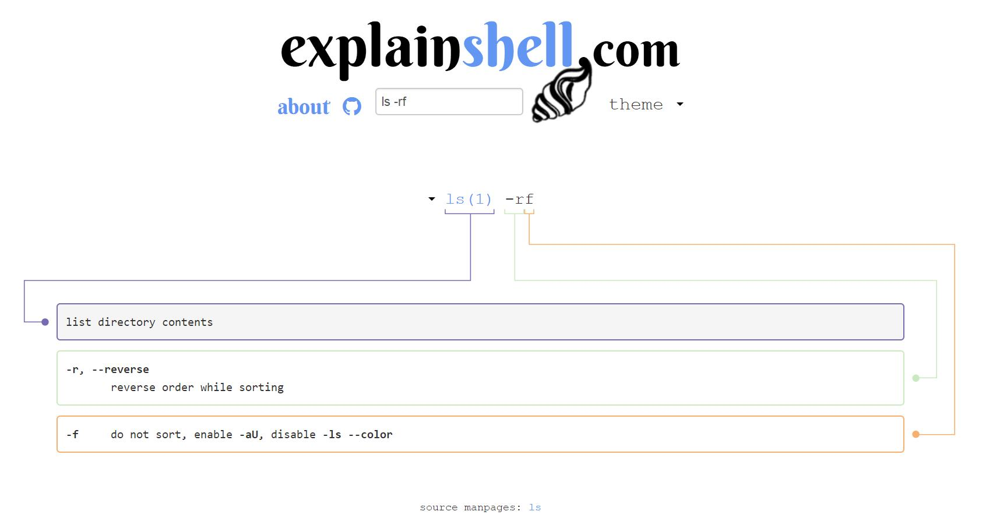

## 几个常用命令的使用方法

### ls  罗列
    * ls 路径
    显示所有文件
    * ls -a 路径
    显示所有目录和文件（文件或目录名称为“.”的视为隐藏，不会列出）；
    * ls -l 路径
    以长格式显示目录下的内容列表。输出的信息从左到右依次包括文件名，文件类型、权限模式、硬连接数、所有者、组、文件大小和文件的最后修改时间等；
    * ls -al 路径
    在ls -l的基础上多显示以“.“开头的隐藏文件；
--------------------
### cat  显示文件内容
    * cat m1
    在屏幕上显示文件ml的内容
    * cat m1 m2
    同时显示文件ml和m2的内容
    * cat m1 m2 > file
    将文件ml和m2合并后放入文件file中
------------------ 
### mv  移动 / 重命名
    * mv 源路径 目标路径
    将某文件从源路径移动至目标路径
    * mv 1.txt 2.txt
    把 1.txt 移到 2.txt ，也就是重命名
------------------
### touch  触摸
    * touch 1.txt
    创建1.txt文件 或 改变该文件的更新时间

## explainshell.com 的使用
1. 想知道某个命令的用法，搜索该命令就能展示其所有的用法。
2. 在输入框内输入一段命令，这个网站就能帮助你解析该命令是如何工作的，简洁易懂。
